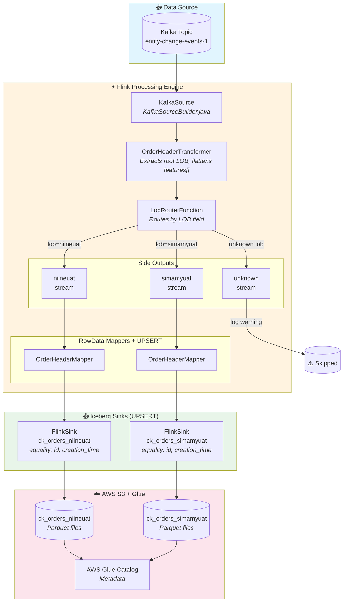
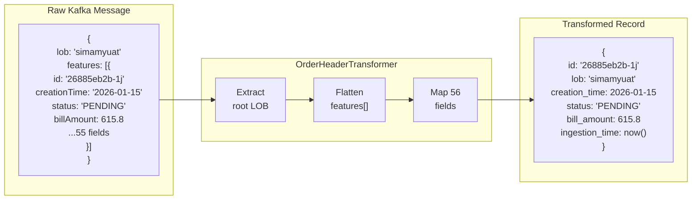
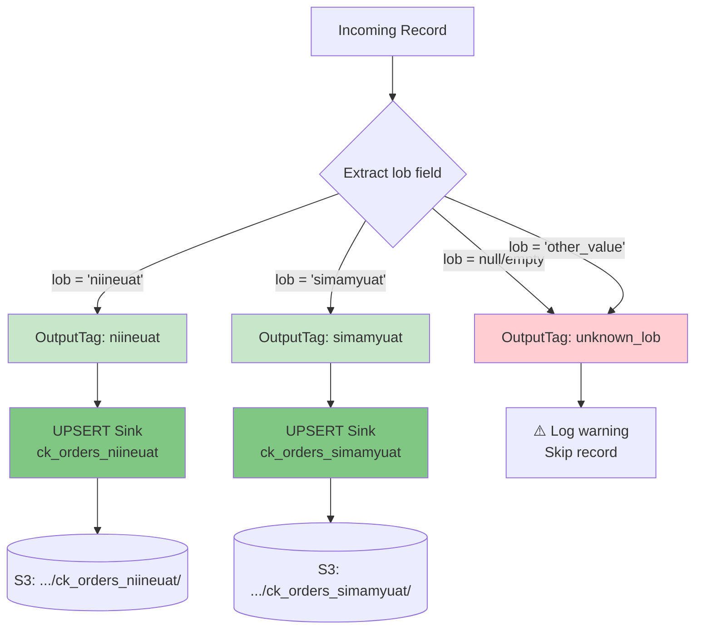
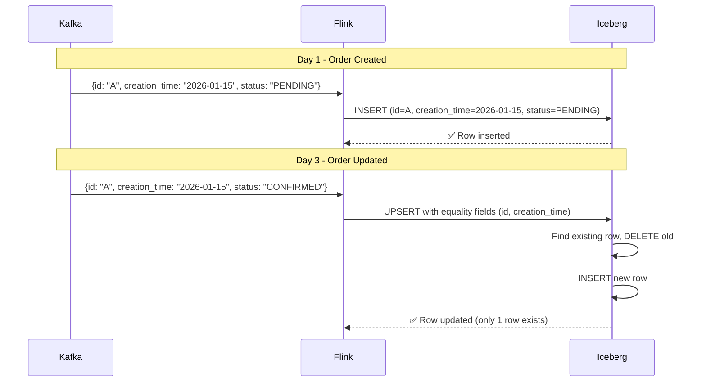
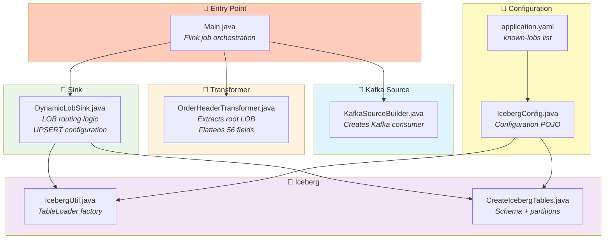
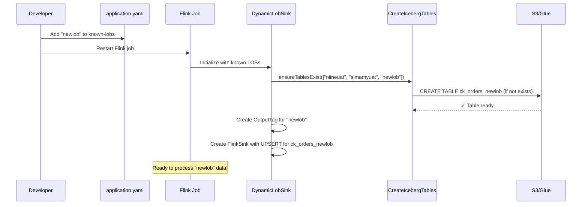

# CDC Pipeline Architecture - Dynamic LOB Routing with UPSERT

## High-Level Flow



---

## Data Transformation Flow



---

## LOB Routing Decision Tree



---

## UPSERT Mode Explained



**Equality Fields:** `["id", "creation_time"]`

| Scenario | Result |
|----------|--------|
| Same `id` + same `creation_time` | **Updates existing row** |
| Same `id` + different `creation_time` | Creates new row (different partition) |

---

## File Structure & Responsibilities



---

## Onboarding New LOB



---

## Table Partitioning

```
ck_orders_{lob}/
├── id_bucket=0/
│   ├── creation_time_year=2025/
│   │   └── *.parquet
│   └── creation_time_year=2026/
│       └── *.parquet
├── id_bucket=1/
│   └── ...
└── id_bucket=15/
```

| Partition | Purpose |
|-----------|---------|
| `bucket(id, 16)` | Even data distribution |
| `year(creation_time)` | Time-range queries + UPSERT equality |

---

## Table Schema (56 Columns)

| Group | Fields | Count |
|-------|--------|-------|
| **Primary Key** | `id` | 1 |
| **Status** | `active_status`, `active_status_reason` | 2 |
| **Audit** | `created_by`, `creation_time`, `last_modified_time`, `modified_by`, `system_time` | 5 |
| **Business** | `lob`, `version`, `source` | 3 |
| **Amounts** | `bill_amount`, `net_amount`, `total_amount`, `total_initial_amt`, `total_mrp`, `nw`, `sales_value` | 7 |
| **Quantities** | `total_initial_quantity`, `total_quantity`, `normalized_quantity`, `initial_normalized_quantity`, `normalized_volume`, `line_count` | 6 |
| **Order IDs** | `order_number`, `reference_number`, `reference_order_number`, `remarks`, `ship_id` | 5 |
| **Location** | `location_hierarchy`, `outletcode`, `supplierid`, `hierarchy`, `user_hierarchy` | 5 |
| **GPS** | `gps_latitude`, `gps_longitude` | 2 |
| **Type/Status** | `type`, `sub_type`, `status`, `status_reason`, `processing_status`, `channel` | 6 |
| **Dates** | `delivery_date`, `sales_date` | 2 |
| **Beat** | `beat`, `beat_name`, `in_beat`, `in_range` | 4 |
| **Misc** | `group_id`, `loginid`, `hash`, `changed` | 4 |
| **JSON** | `extended_attributes`, `discount_info`, `order_details` | 3 |
| **Meta** | `ingestion_time` | 1 |
| | **Total** | **56** |
