# CDC Pipeline Flowchart - Dynamic LOB Routing with UPSERT

```mermaid
flowchart LR
    %% =======================
    %% External Systems
    %% =======================
    subgraph EXT["🌍 External Systems"]
        KAFKA["☁️ Apache Kafka<br/>entity-change-events-1"]
        S3["💾 Amazon S3<br/>Object Storage"]
        GLUE["📚 AWS Glue<br/>Catalog"]
    end

    %% =======================
    %% Flink Application
    %% =======================
    subgraph FLINK["⚡ Apache Flink CDC Application"]
        MAIN["Main.java<br/>🚀 Job Entry Point"]

        %% =======================
        %% Startup / Bootstrap
        %% =======================
        subgraph BOOT["🟢 Application Bootstrap"]
            YAML["📄 application.yaml<br/><i>known-lobs config</i>"]
            CL["ConfigLoader.loadConfig()"]
            AC["AppConfig"]
            ENV["StreamExecutionEnvironment"]
            CHK["enableCheckpointing(30s)"]
        end

        %% =======================
        %% Source
        %% =======================
        subgraph SRC["📥 Source Layer"]
            KSB["KafkaSourceBuilder"]
            KS["KafkaSource<ObjectNode>"]
        end

        %% =======================
        %% Transform
        %% =======================
        subgraph TX["🔄 Transformation Layer"]
            OHT["OrderHeaderTransformer<br/><i>Extract root LOB</i><br/><i>Flatten 56 fields</i>"]
        end

        %% =======================
        %% Dynamic LOB Routing
        %% =======================
        subgraph DYN["🔀 Dynamic LOB Router"]
            DLS["DynamicLobSink<br/><i>LobRouterFunction</i>"]
            
            subgraph TAGS["Side Outputs"]
                TAG1["niineuat"]
                TAG2["simamyuat"]
                TAG3["unknown"]
            end
        end

        %% =======================
        %% Sink (UPSERT)
        %% =======================
        subgraph SNK["📤 Sink Layer (UPSERT)"]
            IU["IcebergUtil<br/><i>TableLoader factory</i>"]
            CIT["CreateIcebergTables<br/><i>Schema + Partitions</i>"]
            
            subgraph SINKS["FlinkSink (UPSERT)"]
                S1["Sink: ck_orders_niineuat<br/><i>equality: id, creation_time</i>"]
                S2["Sink: ck_orders_simamyuat<br/><i>equality: id, creation_time</i>"]
            end
        end
    end

    %% =======================
    %% Iceberg Tables
    %% =======================
    subgraph ICE["🧊 Iceberg Tables"]
        T1["📊 ck_orders_niineuat"]
        T2["📊 ck_orders_simamyuat"]
    end

    %% =======================
    %% Bootstrap Flow
    %% =======================
    MAIN --> YAML --> CL --> AC
    MAIN --> ENV --> CHK

    %% =======================
    %% Streaming Flow
    %% =======================
    KAFKA --> KSB --> KS
    KS --> OHT
    OHT --> DLS

    DLS -->|lob=niineuat| TAG1
    DLS -->|lob=simamyuat| TAG2
    DLS -->|unknown| TAG3

    TAG1 --> S1 --> T1
    TAG2 --> S2 --> T2
    TAG3 -->|⚠️ log & skip| X["Discarded"]

    T1 --> S3
    T2 --> S3
    T1 --> GLUE
    T2 --> GLUE

    %% =======================
    %% Wiring
    %% =======================
    AC --> KSB
    AC --> DLS
    DLS --> IU
    DLS --> CIT

    %% =======================
    %% Styling
    %% =======================
    style EXT fill:#e1f5fe
    style FLINK fill:#fff3e0
    style ICE fill:#e8f5e9
    style DYN fill:#f3e5f5
    style SNK fill:#c8e6c9
```



---

## Data Flow Summary

```
Kafka Message
    │
    ▼
┌─────────────────────────────────┐
│   OrderHeaderTransformer        │
│   • Extract root LOB            │
│   • Flatten features[] → 56 cols│
│   • Add ingestion_time          │
└─────────────────────────────────┘
    │
    ▼
┌─────────────────────────────────┐
│   DynamicLobSink                │
│   LobRouterFunction             │
│   • Route by 'lob' field        │
└─────────────────────────────────┘
    │
    ├── lob=niineuat  ──► FlinkSink (UPSERT) ──► ck_orders_niineuat
    ├── lob=simamyuat ──► FlinkSink (UPSERT) ──► ck_orders_simamyuat
    └── unknown       ──► Log warning, skip
```

---

## UPSERT Mode

**Equality Fields:** `["id", "creation_time"]`

| Same ID + Same creation_time | → Updates existing row |
|------------------------------|------------------------|
| Same ID + Different creation_time | → Creates new row (different partition) |

---

## Adding New LOB

1. Add to `application.yaml`:
   ```yaml
   known-lobs:
     - niineuat
     - simamyuat
     - newlob  # ← Add here
   ```

2. Restart Flink job - table `ck_orders_newlob` is created automatically!
